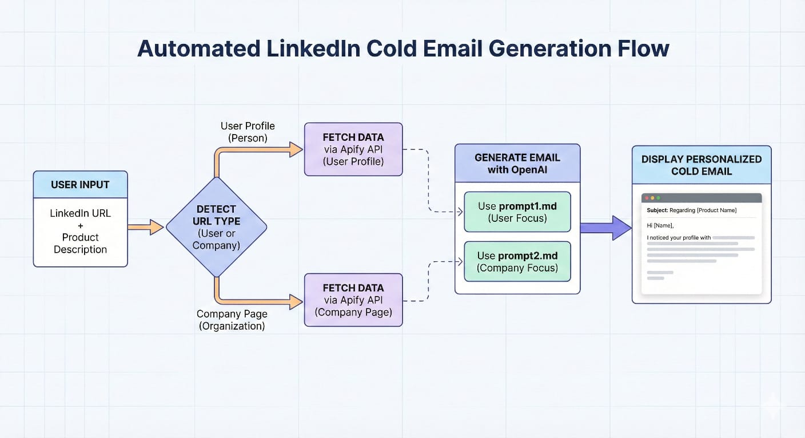

# Cold Email Generator

Generate hyper-personalized cold emails from LinkedIn profiles using AI.

## Features

- 🔗 **Dual Support**: Works with both individual LinkedIn profiles (`/in/username`) and company pages (`/company/name`)
- ✉️ **AI-Powered**: Uses OpenAI GPT to generate personalized ~60-word cold emails
- 🎯 **Hyper-Personalized**: Extracts hooks from tech stack, role, company mission, and more
- 📝 **Product Context**: Include your product one-liner for relevant pitches

## How It Works

```
User enters LinkedIn URL + Product Description
        ↓
Detect URL type (user or company)
        ↓
Fetch data via Apify API
        ↓
Generate email with OpenAI (prompt1.md for users, prompt2.md for companies)
        ↓
Display personalized cold email
```




## Project Structure

```
├── app.py                    # Flask web server
├── fetch_user_profile.py     # Apify actor for user profiles
├── fetch_company_profile.py  # Apify actor for company pages
├── generate_email.py         # OpenAI email generation
├── prompt1.md                # Prompt for individual profiles
├── prompt2.md                # Prompt for B2B company outreach
├── templates/
│   └── index.html            # Web UI
├── AllFiles/                 # Working directory for temp files
```

## Setup

1. Clone the repository
2. Install dependencies:
   ```bash
   pip install -r requirements.txt
   ```
3. Create a `.env` file with:
   ```
   OPENAI_API_KEY=your_openai_api_key
   APIFY_TOKEN=your_apify_token
   APIFY_USER_ID=your_apify_user_id_here
   ```
4. Run the app:
   ```bash
   python app.py
   ```
5. Open http://localhost:5000

## API Endpoints

| Endpoint | Method | Description |
|----------|--------|-------------|
| `/` | GET | Web interface |
| `/api/validate-url` | POST | Validate LinkedIn URL format |
| `/api/generate` | POST | Generate cold email |
| `/api/get-result` | GET | Get last generation result |

## Tech Stack

- **Backend**: Flask
- **LinkedIn Data**: Apify
- **AI**: OpenAI GPT API
- **Frontend**: Vanilla HTML/CSS/JS

## Demo URLs
1. *Demo Video*: Watch the full product walkthrough on Loom - [https://www.loom.com/share/1234567890abcdef](https://www.loom.com/share/e03b9e3ce6ff4178be1884e9e2eb400d)
2. *Hosted Demo URL*: Try the hosted project here - [https://promepy.pythonanywhere.com/](https://promepy.pythonanywhere.com/)
